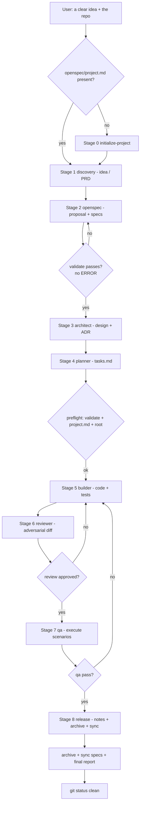
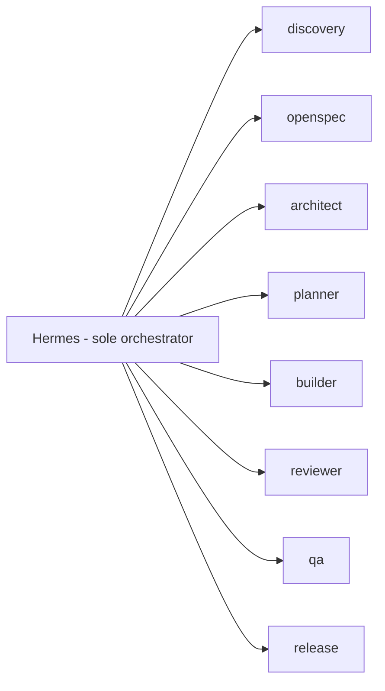

# SDD Feature Lifecycle — how the agency builds a feature

The complete internal path a feature takes in this agency, from idea to archived.
Defined by `rules/orchestration.md` (who may do what), `rules/openspec.md` (the gate),
`rules/project-boundaries.md` (what lives where) and the stage workflows in `workflows/`.

The canonical order (`agents/README.md`):

```
initialize-project → idea-to-openspec → openspec-to-architecture → plan-change
  → implement-change → review-change → qa-change → release-change
```

Hermes is the only orchestrator: it decides which stage runs, delegates one bounded
task per agent, validates every output in the real repo, applies retries and blockers,
asks the human on ambiguity, and closes with a final report. The user's only real input
is a clear idea + the repo. This document is what runs internally.

## Lifecycle at a glance



Key invariants on the path (see `rules/`):

- **Hermes is the only bus.** Agents never talk to each other; every output returns to
  Hermes in the mandatory envelope and is re-verified in the repo before the next stage.
- **Only reviewer and qa may block.** Open BLOCKER/MAJOR, `qa: fail` or any `blocked`
  halts progress.
- **Two failures with the same error ⇒ the spec is wrong**, go back a stage, never in
  circles.
- **Ambiguity of business/architecture/security/scope ⇒ ask the human** (options +
  impact + recommendation), and record the answer in the project.
- **No code without a validated change; every workflow closes with a final report.**

## Roles and the orchestration bus



Each agent answers **only to Hermes**, in the mandated envelope (`status / summary /
projectRoot / filesCreated / filesModified / blockers / nextRecommendedStep / evidence /
openQuestions`), and no agent sees or writes for another. Reviewer and qa are the only
two that can block progress (`rules/orchestration.md`).

---

## Stage 0 — Initialize (first time only)

**Workflow:** `initialize-project.md` · **Writes code:** no

If the repo does not yet have `openspec/project.md` (the marker that it entered the
loop), this runs first. Creates `openspec/`, `project.md` with the product description,
`docs/architecture`, `docs/decisions`, `reports/` and the initialization report.
The mandatory gateway: without this marker nothing starts
(`rules/project-boundaries.md`).

## Stage 1 — Idea / Discovery → PRD

**Workflow:** `idea-to-openspec.md` · **Agent:** discovery (personas `codebase-explorer`, `prd`)

The problem/feature is analyzed before any planning or code:

- The discovery agent **explores the domain**: what exists in the repo, how it works
  today, what it would touch.
- It produces the **PRD** via the `prd` persona ("Generate a comprehensive Product
  Requirements Document"): what the product must do, for whom, success criteria.
  This captures *intent* before any spec.
- If the idea arrives vague, `requirements-clarity` runs first to bound the scope.

> The PRD is product, so it lives in the repo, never in `~/.hermes/`
> (`rules/project-boundaries.md`).

## Stage 2 — Proposal + Specs

**Workflow:** `idea-to-openspec.md` (continues) · **Agent:** openspec (persona `sdd-spec-writer`)

With the understanding clear, an **OpenSpec change** is created via the CLI
(`openspec new change "<name>"` — never by hand):

- `proposal.md`: what is about to change and why.
- `specs/<cap>/spec.md`: the requirement deltas. `## ADDED / MODIFIED / REMOVED
  Requirements` with each requirement carrying its `#### Scenario:` blocks — scenarios
  are the source of truth for behavior. If there is no behavior change (refactor,
  tooling, docs), `skip_specs: true` is used.
- `design.md`: only when there are real decisions to record.

**Gate:** `openspec validate "<name>" --type change --json` must pass **without ERROR**
(the `ℹ INFO` entries are read). Without this, no code is touched — the hard gate
(`rules/openspec.md`). `validate` judges structure, not intent, so the preflight also
greps for known traps (requirements without `#### Scenario:`, invented headers).

## Stage 3 — Architecture

**Workflow:** `openspec-to-architecture.md` · **Agent:** architect (personas
`code-architect`, `architect-reviewer`)

Where the change touches architecture (structural decision, contract, technology,
data model — anything costly to revert):

- Document **boundaries, contracts, rejected alternatives and risks**.
- If warranted, an **ADR** under `docs/decisions/` via `architecture-decision-records`.
- Decide *the solution*, not the how-to-implement. Ambiguous scope/architecture ⇒
  **ask the human** (options + impact + recommendation); the answer is written into the
  project, never into global memory.

The decision is Hermes's per scope: for a change that does not touch architecture this
stage can be minimal or skipped.

## Stage 4 — Plan

**Workflow:** `plan-change.md` · **Agent:** planner (persona `task-decomposition-expert`)

Breaks the change into **granular tasks in `tasks.md`**:

- Steps ≤1 day, ordered, **each one verifiable** (own Done criterion and verification
  command).
- The contract the builder later executes task by task. If planning reveals the spec is
  not implementable, we go back to architecture/idea — never improvise inside the code.

## Stage 5 — Implement

**Workflow:** `implement-change.md` · **Agent:** builder (personas `fullstack-developer`,
`typescript-pro`; `debugger`/`error-detective` when a task stalls)

**The only stage that writes code.** In batches of tasks:

- **Mandatory preflight** before starting: `validate` passing + `project.md` present +
  correct root. Without it, nothing starts.
- The builder touches **only the declared files** (scope rule; real diff is compared
  against the brief).
- Each task writes **its test** (spec scenarios as source of truth; a fix carries a
  regression test that fails without the fix). **No line without a validated spec** —
  `rules/coding.md`.
- Reports in the 9-field envelope with real evidence.

## Stage 6 — Review

**Workflow:** `review-change.md` · **Agent:** reviewer (personas `code-reviewer`,
`code-simplifier`, `supply-chain-security`)

**Adversarial** review of the diff against the spec, design and rules:

- Findings with `severity` (BLOCKER/MAJOR/MINOR/NIT) + `path:line` + impact + proposed fix.
- **Can block**: `changes-requested` halts progress. Open BLOCKER/MAJOR ⇒ no advance.
- On a block the fix returns to the builder with the exact defect and retry with new
  information (never the same brief). Max 3 builder↔reviewer cycles; two failures with
  the same error ⇒ the spec is wrong, go back a stage.

## Stage 7 — QA

**Workflow:** `qa-change.md` · **Agent:** qa (personas `qa-expert`, `test-engineer`)

**Not** a re-run of tests — it validates **real behavior** against the spec scenarios by
executing them (edge cases and the full user path):

- Evidence = real executed result (command + output / failure capture), not reading code.
- **Can block**: `qa: fail` halts. A defect goes back to the builder with its regression
  test. Max 3 cycles. QA neither replaces tests nor is replaced by them
  (`rules/testing.md`).

## Stage 8 — Release / Close

**Workflow:** `release-change.md` · **Agent:** release (persona `git-workflow-manager`)

- **Release notes** coherent with the diff.
- **Archive** the change (`openspec archive`) — only if `validate --archived` passes.
- **Sync specs** to `openspec/specs/<cap>/spec.md` — part of closure, never optional.
- **Final report** (`templates/final-report.md`) written in the project: stages closed
  with evidence, gates run, OpenSpec state, declared debt, decisions, single next step.
- `git status --porcelain` clean (no unexpected changes or temp files).

---

## Where the PRD fits

| Stage | Agent | Artifacts | Writes code? | Can block? |
|---|---|---|---|---|
| 0 Initialize | — | `openspec/`, `project.md` | No | Yes (gate) |
| 1 Idea/discovery | discovery | exploration + **PRD** | No | — |
| 2 Specs | openspec | `proposal.md`, `spec.md`, `design.md` | No | — (validate gate) |
| 3 Architecture | architect | design, ADRs | No | — |
| 4 Plan | planner | `tasks.md` | No | — |
| 5 Implement | builder | code + tests | **Yes** | — |
| 6 Review | reviewer | findings | No | **Yes** |
| 7 QA | qa | executed cases | No | **Yes** |
| 8 Release | release | release notes, archive, report | No | — |

The PRD appears in **stage 1 (discovery)**, before any spec. It is the *product*
requirement (what it does and why); the OpenSpec spec is the *verifiable technical*
requirement (how it behaves, with scenarios). The PRD feeds directly into writing the
spec deltas in stage 2.

The central gate across the whole path: **no code without a validated spec**, and
**every output is re-verified in the repo before advancing** — what an agent says is not
a fact.

## See also

- `rules/orchestration.md` — who orchestrates, envelope, retries, blockers, human approval.
- `rules/sdd.md` — when the full loop runs vs the fast path, and the language contract.
- `agents/README.md` — entry point and reading map.
