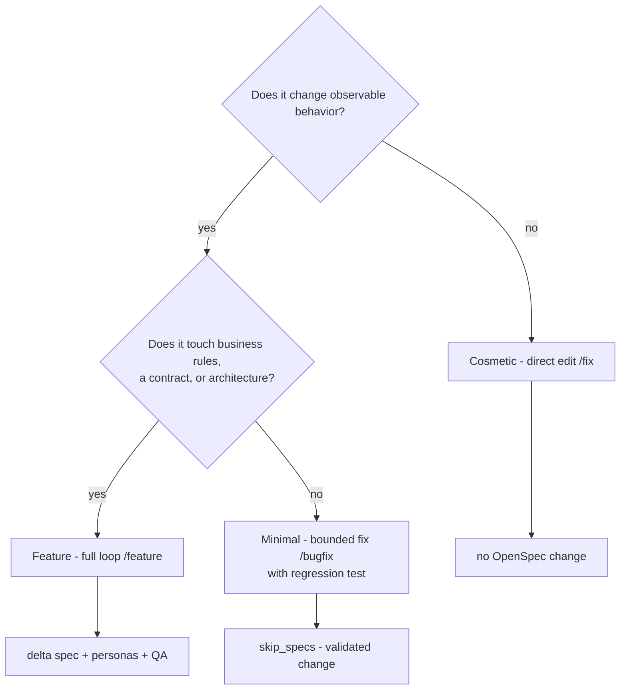
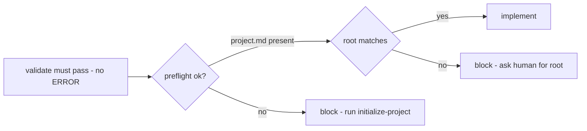

# Usage Examples

Concrete, copy-paste scenarios for driving the Hermes SDD Agency. Each example shows
the trigger, what happens, what you verify, and what you can expect back. They map
onto the three task levels (`rules/openspec.md`) and the full lifecycle
(`docs/sdd-feature-lifecycle.md`).

Assume the agency is installed (`INSTALL.md`) and you are inside a project root:

```bash
cd <your-project>
```

If the project is not yet initialized for the loop, the first stage auto-runs
`initialize-project` (no code is written — only the OpenSpec scaffolding),
`rules/project-boundaries.md`.

## Choosing the right trigger

Hermes classifies every request into one of three task levels (`rules/openspec.md`
"Task size and fast path"). Use the diagram to pick correctly:



---

## Example 1 — Feature (full loop)

**Trigger:**
```bash
/feature
# then describe the feature
```
or, in natural language:
```
hagamos SDD: add SSO login to the web app
```
or:
> *"Build a `search` capability that filters invoices by vendor, date range and amount,
> with pagination."*

**What runs:** `idea-to-openspec → openspec-to-architecture → plan-change →
implement-change → review-change → qa-change → release-change`, starting with the
discovery/PRD analysis.

**What you verify along the way:**
- The OpenSpec change exists and validates:
  ```bash
  openspec list --json
  openspec validate "<change>" --type change --json   # no ERROR
  ```
- The diff stays bounded:
  ```bash
  git status --porcelain
  git diff --stat
  ```
- Final: archive + sync, `git status` clean, a final report in `reports/`.

**What you can expect:** the agency asks the human only when business/
architecture/security/scope is ambiguous (with options + impact). Otherwise it runs
the loop autonomously, stage by stage, and closes with a final report.

---

## Example 2 — Bug fix (minimal, with behavior)

**Trigger:**
```
/bugfix
```
or:
> *"Fixing the invoice total — it rounds wrong when the tax is 21% and the amount has
> decimals. Expected 100.10, got 100.09."*

**What runs:** the **fast path** (`skip_specs: true`). One OpenSpec change is created
with a proposal + a single task, then the fix. The change is validated, applied and
archived — only the requirement deltas are omitted.

**What you verify:**
- A regression test is present and **fails before the fix, passes after**:
  ```bash
  git diff --stat                     # includes the test file
  ```
- The change validates and archives:
  ```bash
  openspec validate "<change>" --type change --json
  ```

**Rule that never bends:** "a one-line fix always carries its regression test"
(`rules/testing.md`). If the fix turns out to touch a business rule or contract, the
agency escalates to `/feature` (full loop) instead of taking the shortcut.

---

## Example 3 — Cosmetic change (no behavior change)

**Trigger:**
```
/fix
```
or:
> *"Rename the local variable `dat` to `data` in `src/parser.ts`."*
> *"Fix the typo in the login error message (it says 'userd' instead of 'user')."*

**What runs:** a direct edit. **No OpenSpec change.** Nothing changed about behavior,
so there is nothing to verify at spec level.

**What you verify:**
```bash
git diff               # only the intended edits
```
**Escalation guard:** if during the edit any observable behavior appears to change,
the agency stops and escalates to `/bugfix` or `/feature`. Cosmetic never carries
behavior; behavior never goes straight to the tree.

---

## Example 4 — Initialize a project for the loop

**Trigger:**
```
/init-proyecto
```

**What runs:** `initialize-project.md`. Creates `openspec/`, `openspec/project.md`
(with the product description), `docs/architecture`, `docs/decisions`, `reports/` and
the initialization report. **Writes no code.**

**What you verify:**
```bash
test -f openspec/project.md && echo OK      # the loop can now start
openspec context --json                     # root.path matches your project
```

---

## Example 5 — Resuming / stage-specific work

A request that names a stage directly jumps to it (`hermes bundles list`):

```
/idea        # turn an idea into a validated change (proposal + specs + design + tasks)
/arquitectura# design the change: boundaries, contracts, rejected alternatives, ADRs
/plan        # break the change into granular tasks.md
/implementar # write the code (the ONLY stage that writes code)
/review      # adversarial review of the diff (can block)
/qa          # validate real behavior against the spec scenarios (can block)
/release     # close: release notes, archive, final repo state
```

---

## Example 6 — Small team, parallel workstreams

Several independent features can run as separate workflows in separate branches
or worktrees, each with its own root, change and final report
(`rules/project-boundaries.md`). Hermes runs independent stages in parallel via
`delegate_task`; dependent stages wait on verified output.

---

## Example 7 — What an agent actually returns (the envelope)

Every agent reply — builder, reviewer, qa, the rest — is a **structured envelope**
(`rules/orchestration.md`). A sample builder response after one task of a change:

```yaml
status:              done
summary:             Implemented the vendor filter with pagination and its unit tests.
projectRoot:         /Users/alice/projects/invoice-search
filesCreated:        [src/operators/vendor-filter.ts, src/__tests__/vendor-filter.test.ts]
filesModified:       [src/index.ts, src/types.ts]
blockers:            []
nextRecommendedStep: proceed to review
evidence:            'bun test src/__tests__/vendor-filter.test.ts -> 3 passed, 0 failed'
openQuestions:       []
```

Hermes **re-verifies every claim** in the repo before advancing: it runs
`git status --porcelain` to confirm `filesCreated`/`filesModified` match the real diff,
and runs the gate itself. **An agent's output is a self-report, not a fact.**

### The gate that stops implementation



No implementation code exists before all of these pass from the project root
(`rules/openspec.md`):

```bash
test -f openspec/project.md                        # else run initialize-project first
openspec context --json                            # root.path == expected root
openspec validate "<name>" --type change --json     # no ERROR
openspec instructions apply --change "<name>" --json  # state: ready
```

---

## Anti-patterns (what NOT to do)

- **"Just make it work"** without /feature or /bugfix → the agency has no scope to
  validate; ask for the level, or classify it for you.
- **Skipping the regression test on a fix** because it is small → rejected; the agency
  sends it back with the evidence requirement (`rules/quality.md`).
- **Putting product requirements in global memory or rules** → they belong in the
  project's `openspec/`, never in `~/.hermes/**`.
- **Letting the builder touch files outside the declared scope** → flagged by the
  reviewer.
- **Mixing two projects in one change** → separate workflows, always.

---

## See also

- `docs/sdd-feature-lifecycle.md` — the full internal path, stage by stage.
- `README.md` — system overview, gate, install, rules.
- `INSTALL.md` — installation and verification.
